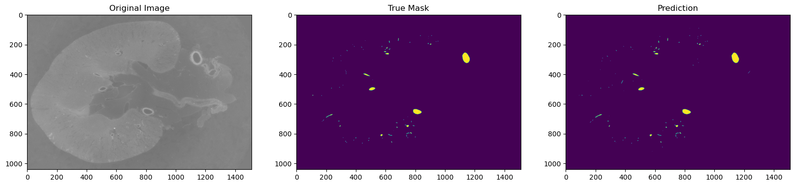
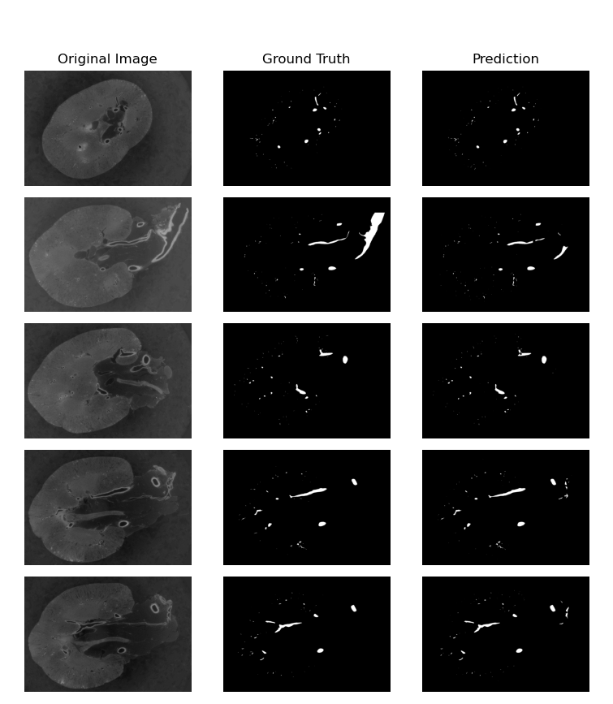
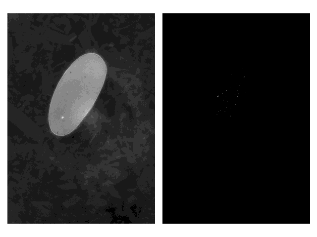
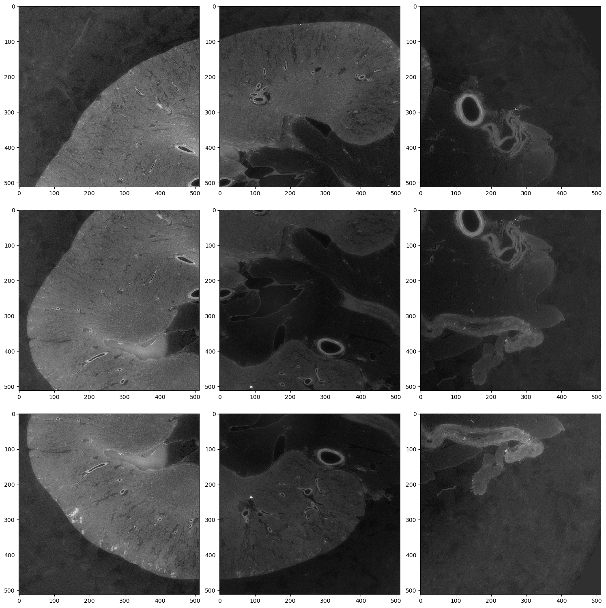

# 3DImprovedUNet
#### This is my entry to the [SenNet + HOA - Hacking the Human Vasculature in 3D](https://www.kaggle.com/competitions/blood-vessel-segmentation) Competition on Kaggle

## Files:
`train.py` - script for training the model \\
`evaluate.py` - script for evaluating model \\
`utils.py` - helper functions

## TLDR:
The goal of this project is to automatically segment the blood vessels from high resolution 3D Hierarchical Phase-Contrast Tomography (HiP-CT) scans of human kidneys. A 2D Attention gated UNet was used to achieve this by predicting segmentation masks for 2D slices of the kidney scans, as this method yields higher accuracy then fully 3D methods and is comparable to 2.5D 'stacked slice' methods.

Example:

 \\

## Data:
The data for 

Animation: \\

### Data pre-processing:
Images are broken into 512x512 tiles that are uniformly distributed over the image with some stride. After inference, the overlapping sections of the predictions are averaged, which acts as a form of TTA (test time augmentation) to resulting in improvements in accuracy at the expense of higher inference time due to more passes through the model. Increasing the number of image tiles improves accuracy with diminishing returns. In testing, increasing the number of tiles from 3x3 to 8x6 resulted in a 3.27% increase in the 3D surface dice coefficient, while requiring 48 passes through the model per image rather then 9.

## Model:

## References:
1. Yashvardhan Jain, Katy Borner, Claire Walsh, Nancy Ruschman, Peter D. Lee, Griffin M. Weber, Ryan Holbrook, Addison Howard. (2023). SenNet + HOA - Hacking the Human Vasculature in 3D. Kaggle. https://kaggle.com/competitions/blood-vessel-segmentation